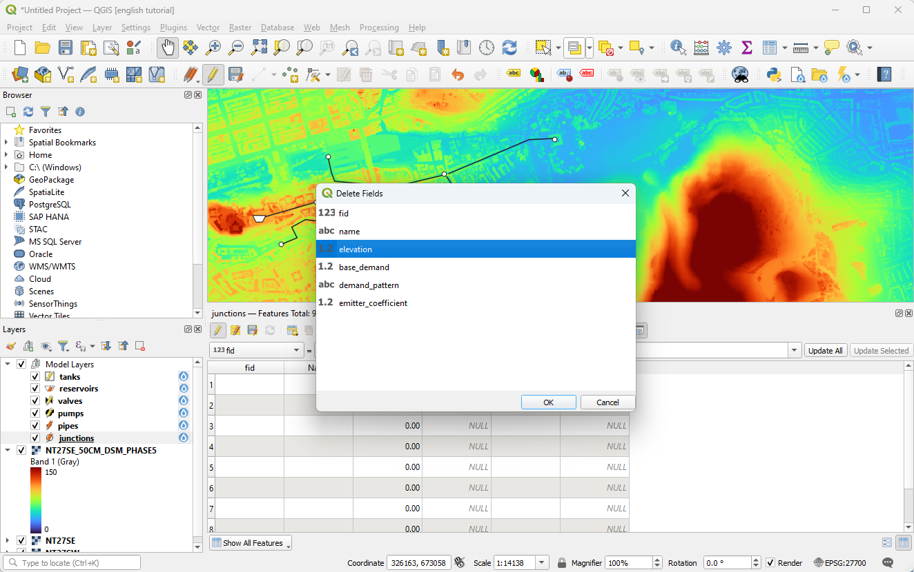

# Adding height data

1. We will use the same backdrop as in the previous tutorial. This time we are going to draw a bigger network, so I recommend creating geopackage layers, so they are easy to save. Draw out a network as below. Before drawing the pipes, you may want to change the default pipe diameter - in this case we will use 75mm inner diameter pipe. Leave everything else as their default values for now.

2. Load a digital elevation model. Use can download [this one](../_static/add-heights/NT27SE_50CM_DSM_PHASE5.tif) which is a low-resolution extract of data available from the [Scottish Government](https://remotesensingdata.gov.scot/data#/map).  You can style it to make the elevation differences very obvious.

3. Now we will add the heights. First of all open the attribute table, and you will see there is an 'Elevation' field. Rather than setting the value of this field as a one-off, we are going to use a 'virtual field' to calculate it on the fly. We therefore need to delete the exiting field.

4. Open the field calculator and create a new virtual field of type 'Decimal (double)'. Call it 'elevation'. Use the following formula:
`raster_value('NT27SE_50CM_DSM_PHASE5',1,@geometry)`

5. You should now see calculated values in the attribute table. If you move the junctions in future, they will update automatically.

6. Set a demand by selecting the nodes you want to add a demand to, then you can set them all at once in the attribute table. In this case they are set to 1 l/s.

7. Run the model. If you forgot to set the elevation on the reservoir you will get a low pressure warning. You can fix this by setting the reservoir elevation manually. You could also follow the same process as for junctions, but typically reservoir elevation is known precisely, and there are much fewer of them so it is not time consuming to do manually.

8. Once run succesfully, your network will be displayed. You can add labels to show the head at each junction using the following label value `round(pressure, 1) || 'm'`

Zoom in and you will notice that pipes have been snapped to their nearest node as part of the analysis.

