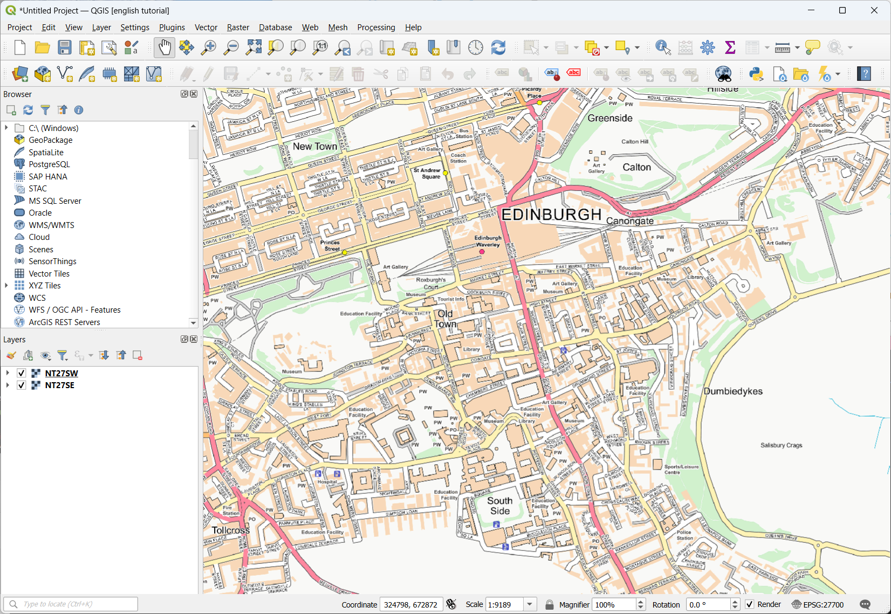
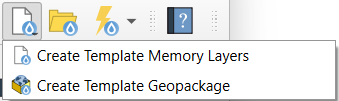
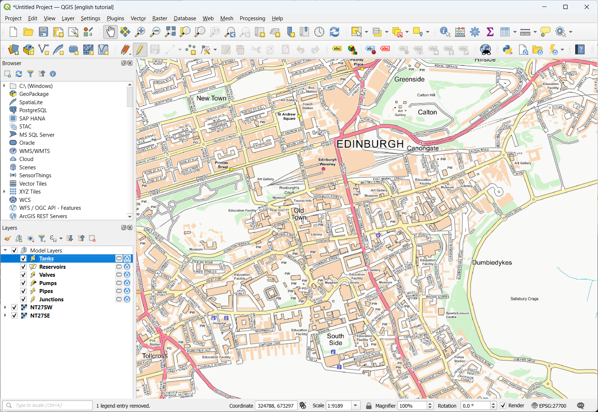
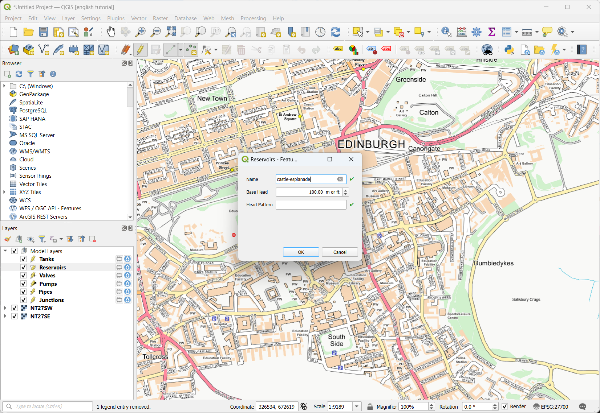
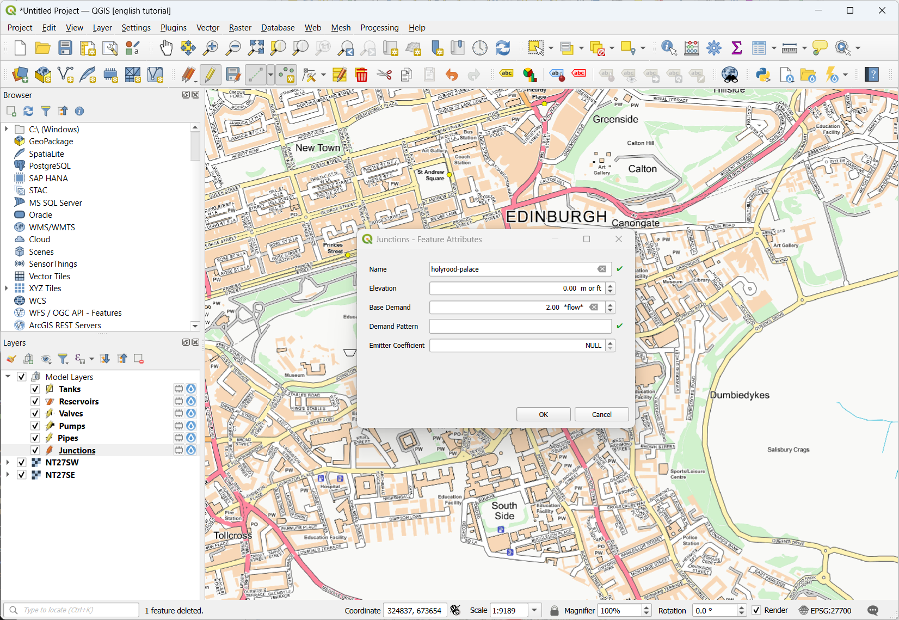
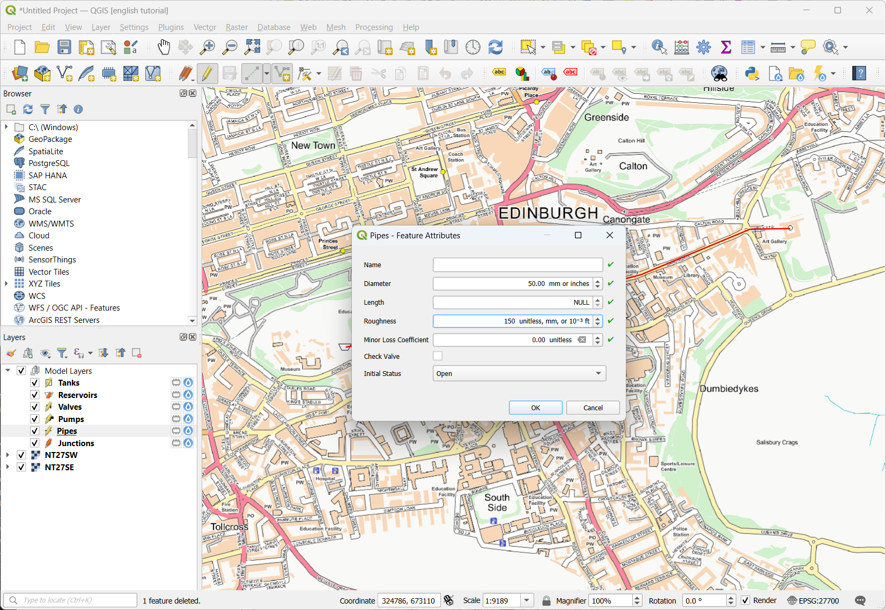
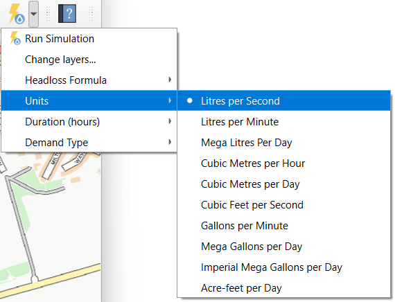
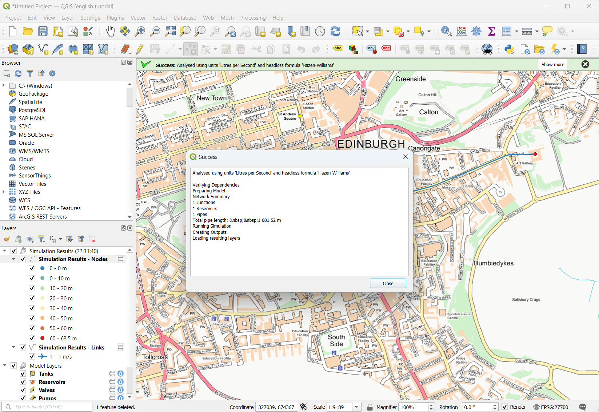
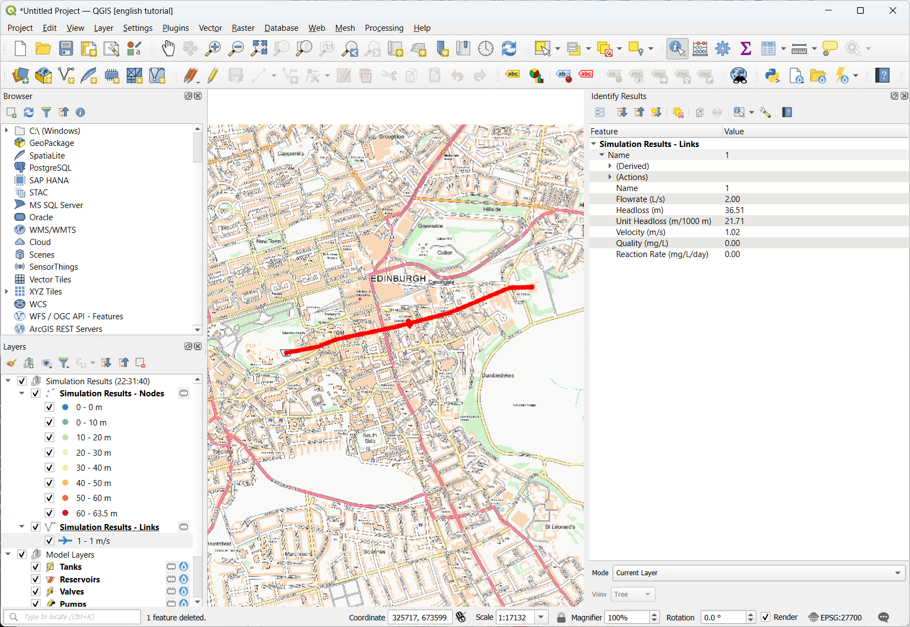
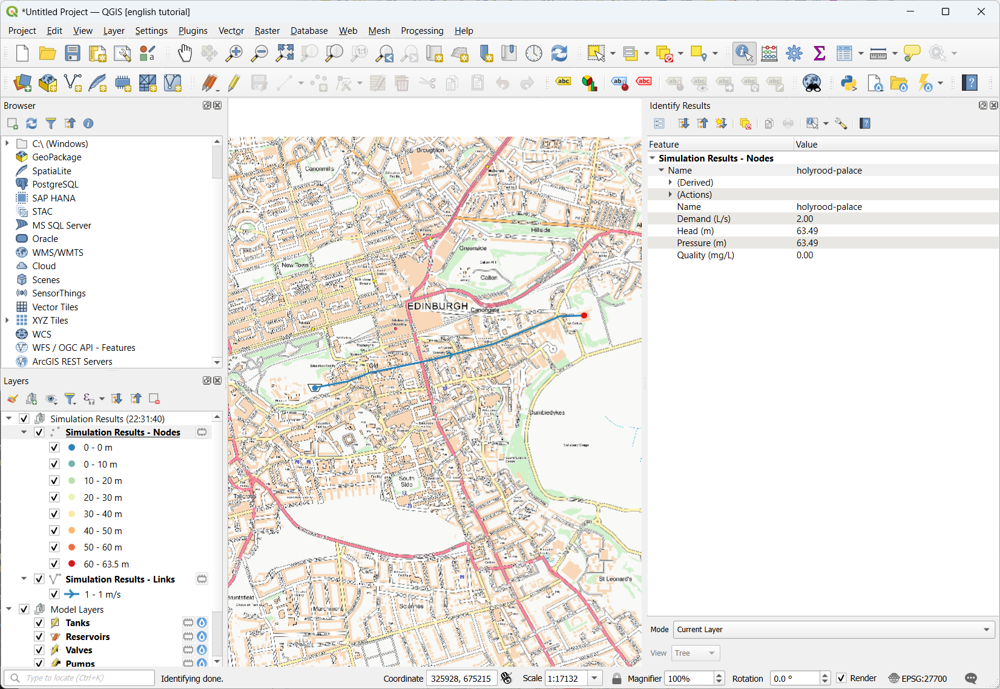

# Create a New Model

Here we will create a very simple model.

We will load a backdrop of Edinburgh, Scotland, and connect an imaginary reservoir at Edinburgh Castle to the royal residence at Holyrood Palace, 100 metres lower, which requires 2 litres / second demand.

1. Load a backdrop: download the following two background images of Edinburgh [West](../_static/create-new-model/NT27SW.tif) and [East](../_static/create-new-model/NT27SE.tif) (from [OS OpenData](https://osdatahub.os.uk/downloads/open/OpenMapLocal)). Then drag and drop them into QGIS. The coordinate systems will be set to ESPG:27700, which is the British National Grid.

2. Create some template layers using the button on the toolbar. For this exercise we will use 'Memory Layers'. If we want to keep the model for later we will need to save them into files later.

3. Add a reservoir by selecting the reservoir layer and using the 'Add Point Feature' tool.

4. Add a junction in the same way as the reservoir. We have added the junction at Holyrood Palace. We will give this a demand of 2 litres/second. We can say it is at 0 metres elevation.

5. Add a pipe using the 'Add Line Feature' tool. We won't give this a length - it will be calculated automatically. We will give it a diameter of 50mm though.

6. Run the model using the 'lightning' icon. Before doing so check the settings. We have used the defaults  (Hazen Williams equation, litres per second, single time simulation, fixed demand) so there should be nothing to change.

7. View the link results by selecting the link layer and using the 'Identify Features' icon on the toolbar. When you click on the pipe the attributes will be displayed in the side panel.

8. View the node results in the same way.

