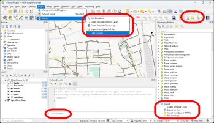

# Key Principles

Gusnet is a QGIS Plugin.It  will feel familiar to anyone who has used Epanet or any other water network modelling software.

It accessed in different ways within QGIS:
1. Through the toolbar buttons or within the 'Plugins' menu.
2. Through the Processing Toolbox. This gives more options and allows for automation, including chaining with other algorithms using the {ref}`graphical modeller <qgisdocs:processing.modeler>`.
3. Using Python in the {ref}`Python Console <qgisdocs:pythonconsole>`. This allows for advanced functionality.

Whilst Gusnet is very flexible in how it's used, the key principles are the following four steps:

1. **Model Creation.**
Draw the pipes, junctions, reservoirs, tanks, valve and pumps. These are just regular QGIS layers, lines and points. Use empty template layers; import an Epanet .inp file; or create them manually.

1. **Model Editing.**
Use external data sources for elevations, background maps and more.

1. **Running the simulation.**
Gusnet will run your model using Epanet and produce a link and a node layer containing the results.

1. **Viewing the results.**
Use all of QGIS's styling functions to look at all the results in nodes and links - pressure, flow, head, etc.  Use QGIS's temporal manager to view how the results change over time.
