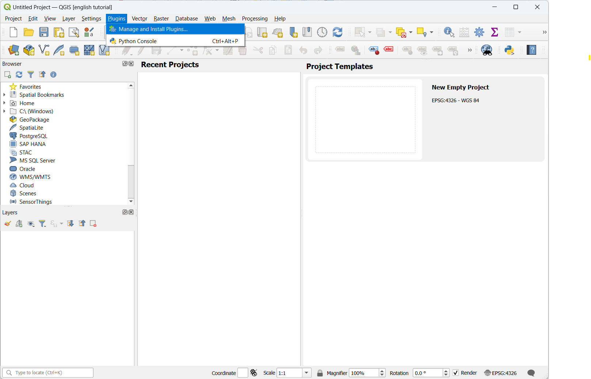
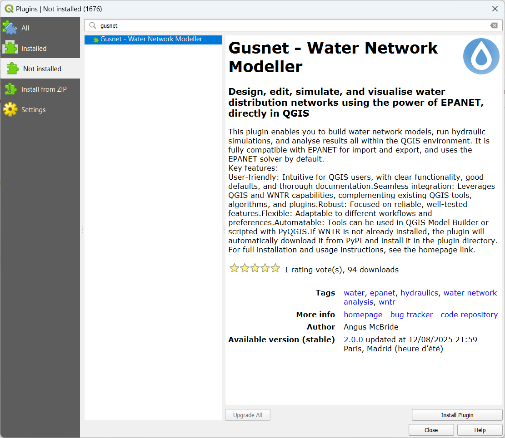
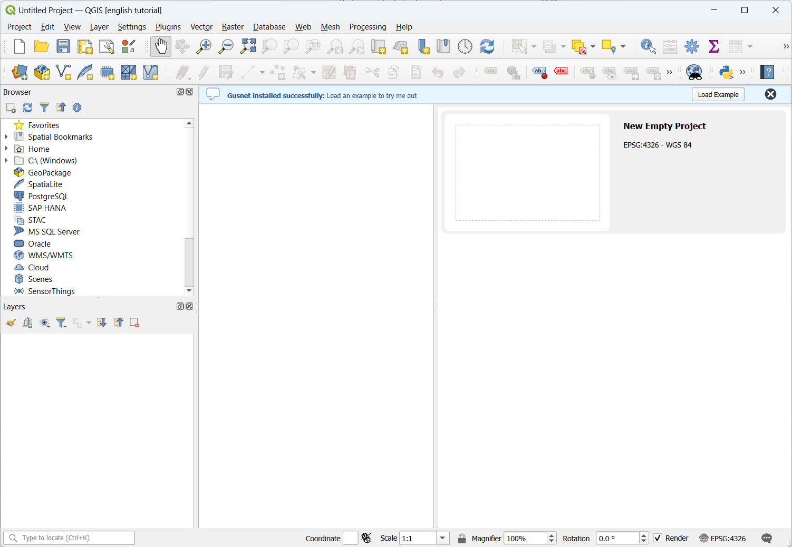

# Installation

Gusnet is a plugin for QGIS, so you need to have QGIS installed.  If you haven't already you can get it [from their website](https://www.qgis.org/download/) (it's free and open source). If you already have it, check that it's version 3.34 or greater.

Within QGIS, go to the *Plugins* menu, select *Manage and Install Plugins...*,  search for 'Gusnet' and click *Install Plugin*.

If the WNTR python package is not already installed in the QGIS python environment, it will be installed within the plugin directory automatically.

WNTR itself has some python dependencies. A warning will appear if any are missing.
* On *Windows* all dependencies are already included within QGIS.
* For *Linux / Mac* you will need to ensure that the following python packages are installed: Numpy, Scipy, Pandas, NetworkX and Matploblib. Exactly how to do this depends on your system and how you have installed QGIS.

## Visual Install Guide

1. Open *Manage and Install Plugins...* from within QGIS

2. Search for 'gusnet'

3. Wait for the install to complete

