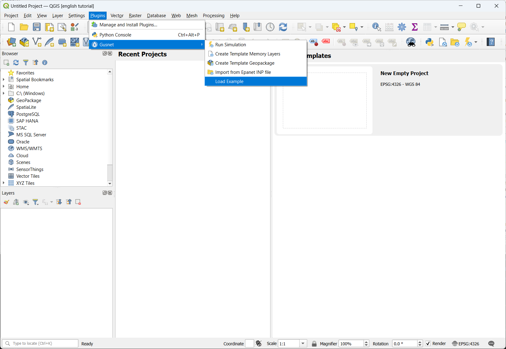
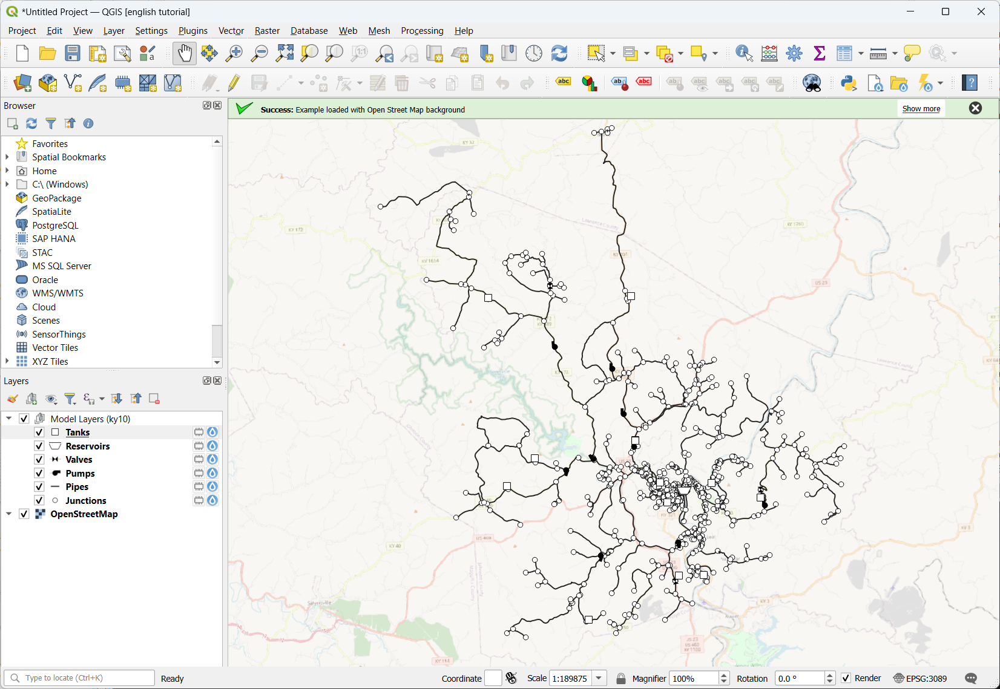
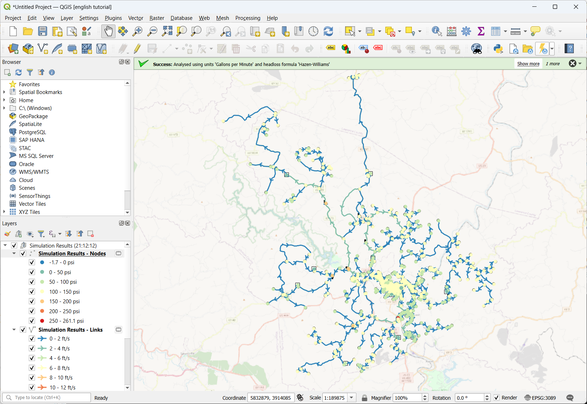
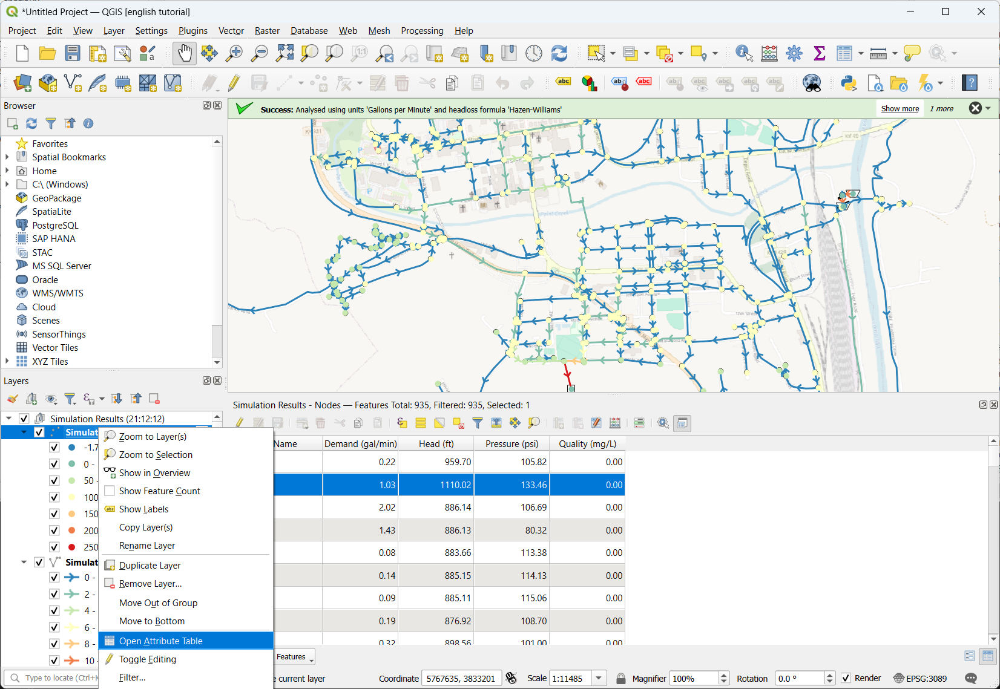

# Load an Example

With Gusnet installed, you can now load an example that comes included with Gusnet.

1. Select 'Load Example' from the menu

2. Example inp file will be loaded, along with an openstreetmap background. You will see the different layers loaded into the layers panel.

:::{tip}
If you aren't zoomed automatically to where you can see the network, right click on one of the layers and click 'Zoom to Layer(s)'
:::

3. Run the example by selecting the 'lightning' icon on the toolbar or 'Run Simulation' in the menu.

4. You open the attribute table of one of the results layers to see the calculated results.

